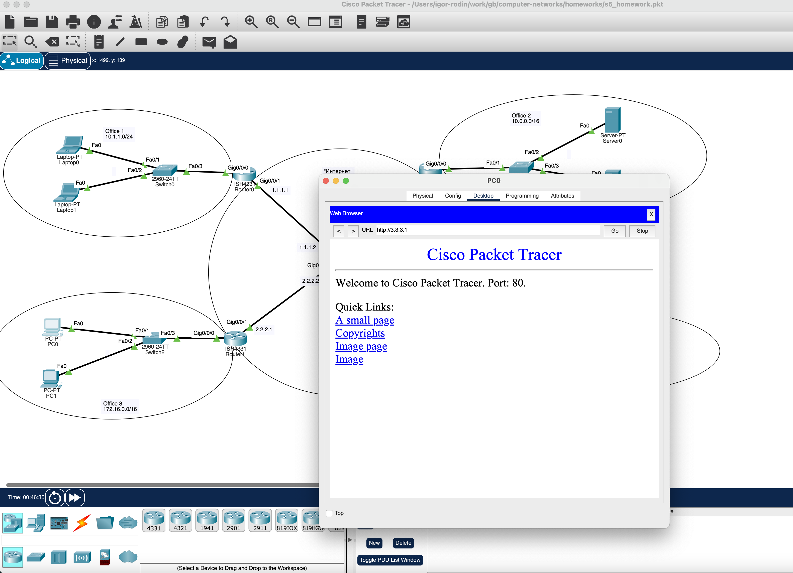
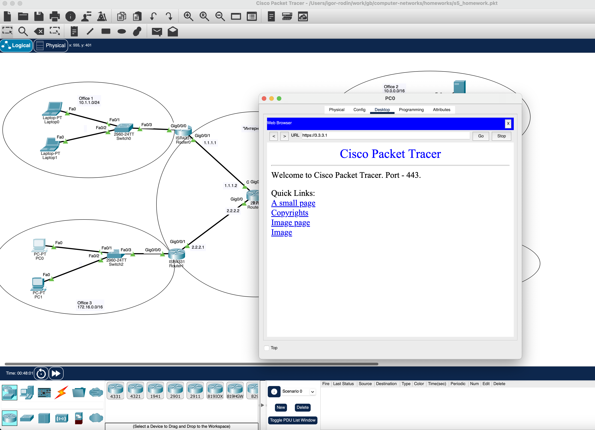
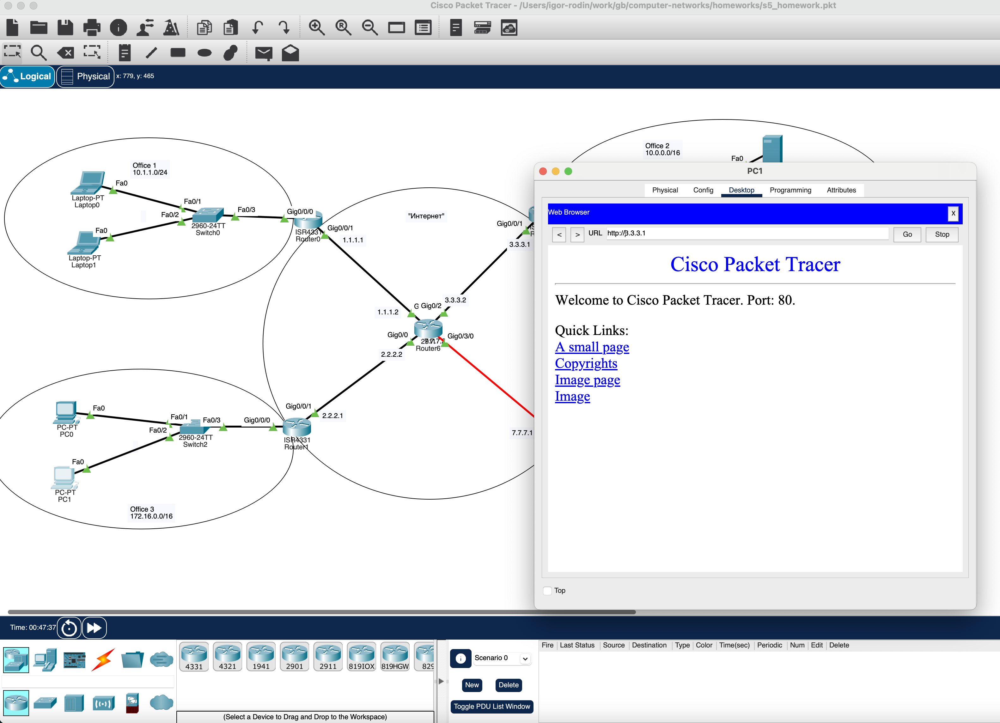
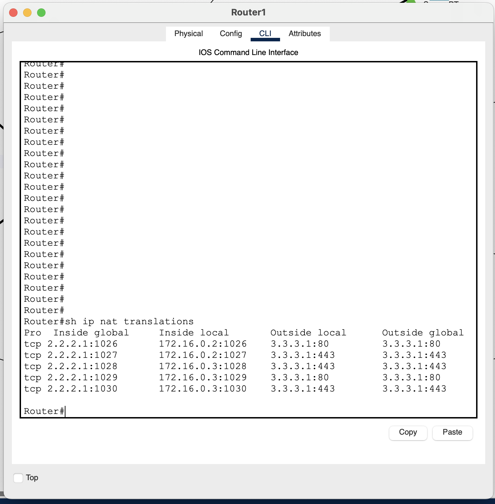
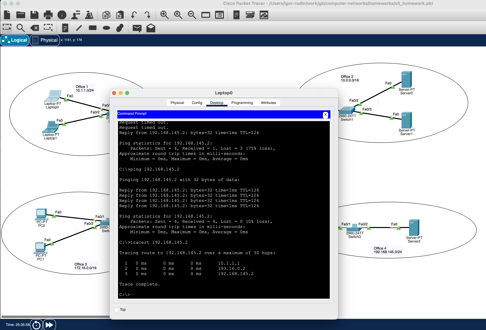
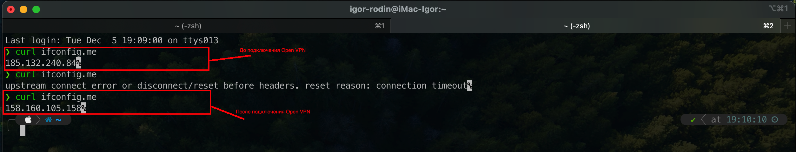
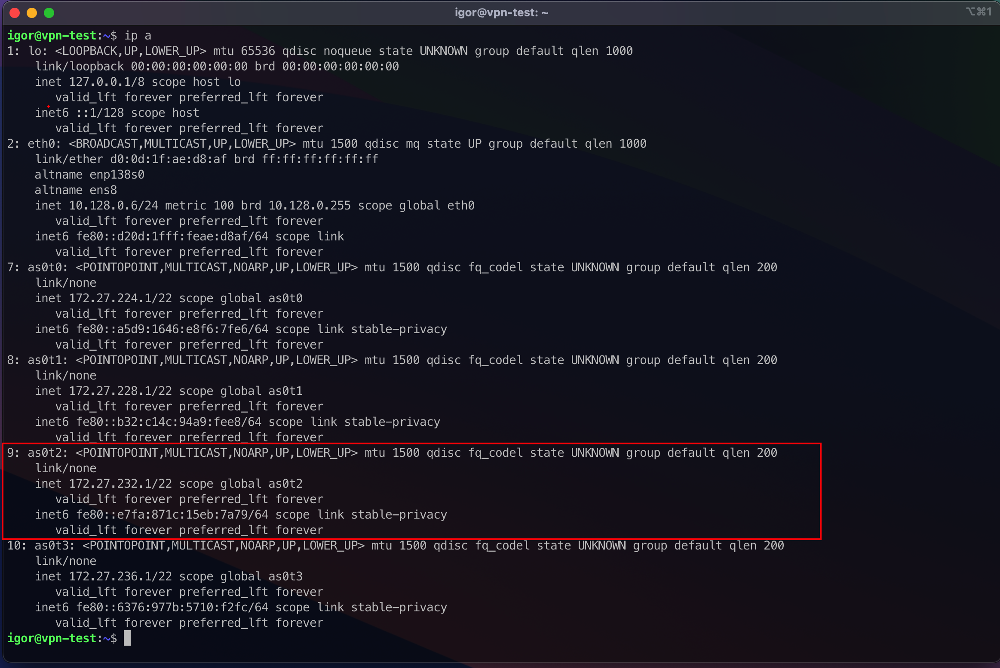
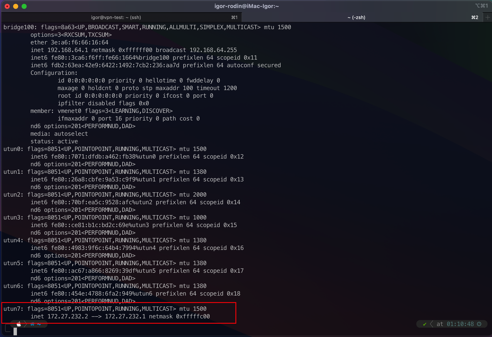

# Компьютерные сети (семинары)

## Урок 7. NAT. GRE

1. Cтраницы по HTTP и HTTPS по публичному адресу Router3 в веб-браузере клиентов Office3 (с РС1 и РС0)

    PC0: port 80
    

    PC0: port 443
    

    PC1: port 80
    

    PC1: port 443
    

    Вывод show ip nat translation c Router1

    

2. Трейс с Laptop0 до Server2

    

3. Публичный IP до и после подключения через VPN

    

    Вывод команды ip addr на сервере:

     

     Вывод команды ifconfig на клиенте:

     
