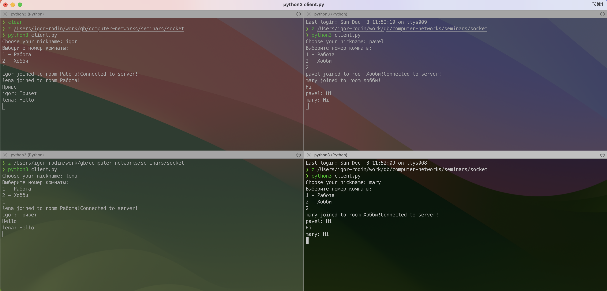
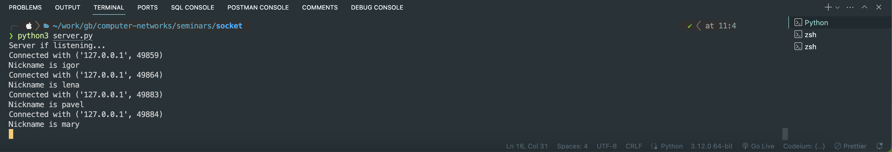
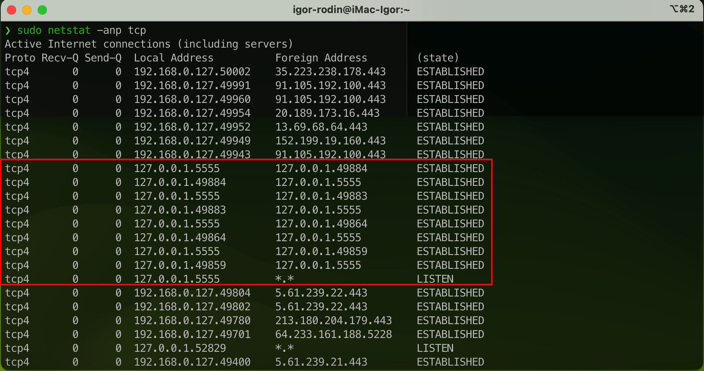
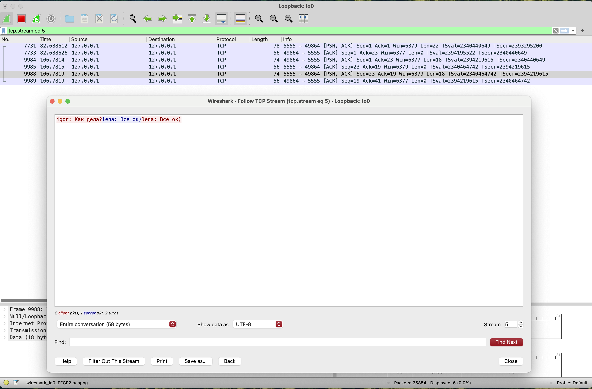

# Компьютерные сети (семинары)

## Урок 6. Основы компьютерных сетей. Транспортный уровень. UDP и TCP

1. Добавил комнаты в чате

2. Имитация работы чата

     

    Лог сервера

    

3. Лог netstat

    

4. Лог Wireshark

    
